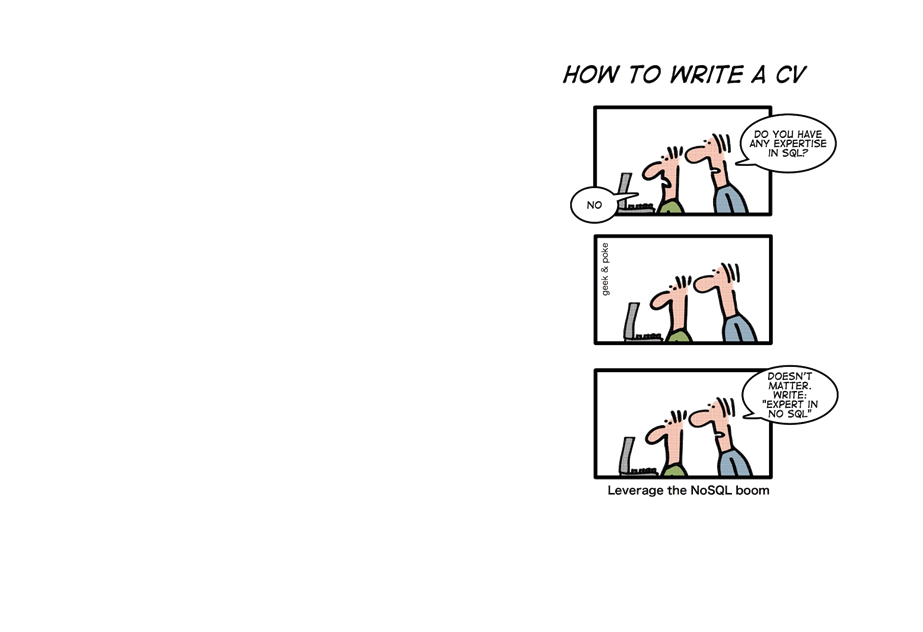

# Data-Bases

These mini projects were created as part of DATABASES 2020 course @ Hebrew University of Jerusalem.

Projects 1 and 2 contain some SQL quaries, while project 3 is an implementation of External Merge Sort and Sort Merge Join algorithms which are used for manipulating data that is too large to fit into the main memory of a computer. 

Project 3 is composed of 4 main methods:

1) SORT method that performs a two-phase external merge sort on a given input file with the content R(A,B,C) and outputs the table sorted by first column.

2) JOIN method that performs a sort-merge join on two input files with the content of two sorted tables R(A,B,C) and S(A,D,E), and outputs the joined table RS(A,B,C,D,E). 

3) SELECT method that receives as input table RS(A,B,C,D,E) and a condition, and outputs only tuples that satisfy the condition.

4) joinAndSelectEfficiently method that receives tables R(A,B,C) and S(A,D,E), sorts them and joins them, but this time the selection condition is checked in the first reading of the input files and not after the join (this is a lot more efficient..). 

